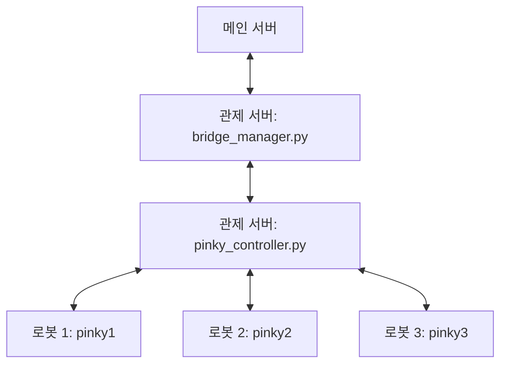

# 핑키 관제 서버 가이드 (Pinky Control Server)

이 문서는 핑키 로봇(pinky1, pinky2, pinky3)을 관제 서버에 연결하고 통합 제어하는 방법에 대해 설명합니다.

## 1. 하드웨어 및 네트워크 준비
중앙 관제 서버와 로봇들이 정상적으로 통신하기 위해서는 아래 조건이 반드시 충족되어야 합니다.

- **네트워크**: 모든 로봇과 관제 서버(PC)가 동일한 Wi-Fi 네트워크에 연결되어 있어야 합니다.
- **ROS_DOMAIN_ID**: 모든 로봇과 관제 PC의 환경 변수 `ROS_DOMAIN_ID`가 동일하게 설정되어야 합니다. (예: `export ROS_DOMAIN_ID=30`)
- **네임스페이스**: 각 로봇은 실행 시 `--ros-args -r __ns:=/pinky1`과 같이 고유한 네임스페이스를 가지고 실행되어야 합니다.

## 2. 시스템 연결 구조 (Architecture)

관제 서버는 ROS 2의 **발견(Discovery)** 기능을 통해 로봇들과 자동으로 연결됩니다.



- **로봇 -> 관제 서버**: 로봇은 배터리 상태, 현재 위치(TF) 등을 ROS 토픽으로 방송합니다.
- **관제 서버 -> 로봇**: `pinky_controller.py`가 Nav2 액션을 사용하여 각 로봇에게 목표 지점(Goal)을 전달합니다.
- **관제 서버 -> 메인 서버**: `bridge_manager.py`가 로봇들의 통합 상태를 모아 JSON 포맷으로 메인 서버 API에 보고합니다.

## 3. 실행 방법

### 단계를 지켜서 실행해 주세요:

1. **로봇 준비**: 각 로봇에서 Bringup 및 Navigation 패키지를 실행합니다. (각 로봇별 네임스페이스 확인 필수)
2. **관제 컨트롤러 실행**:
   ```bash
   python3 pinky_controller.py
   ```
3. **브릿지 매니저 실행**:
   ```bash
   python3 bridge_manager.py
   ```

## 4. 관련 파일 안내
- `pinky_controller.py`: 3대 로봇의 순차 이동 로직 및 상태 관리 핵심 코드.
- `bridge_manager.py`: 외부 서버(HTTP API)와의 통신을 전담하는 코드.
- `WAYPOINTS`: `pinky_controller.py` 내부에 정의된 좌표들. 실측 좌표로 수정하여 사용하세요.

## 5. 자주 묻는 질문 (FAQ)
- **Q: 로봇 워크스페이스에 코드를 추가해야 하나요?**
  - A: 아니요. 로봇은 표준 ROS 2 토픽/액션 인터페이스만 제공하면 됩니다. 모든 서버 연동 로직은 이 관제 서버 폴더 안에 모여 있습니다.
- **Q: 연결이 안 됩니다.**
  - A: `ros2 topic list` 명령어로 현재 PC에서 `/pinky1/battery/present` 등의 토픽이 보이는지 먼저 확인하세요. 안 보인다면 네트워크나 `ROS_DOMAIN_ID` 문제입니다.
